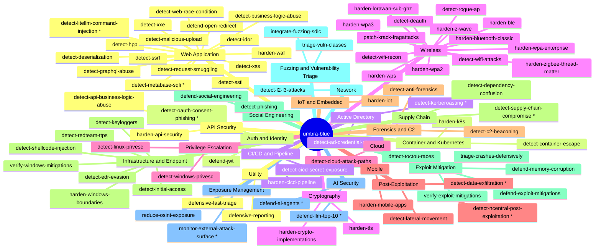

# umbra-blue - Library Mindmap

Every skill in the library by category. Tier 1 skills are marked with a star.

<!-- Generated by tools/build_manifest.py. Do not edit by hand. -->

```mermaid
mindmap
  root((umbra-blue))
    Web Application
      detect-litellm-command-injection *
      detect-metabase-sqli *
      defend-open-redirect
      detect-business-logic-abuse
      detect-deserialization
      detect-graphql-abuse
      detect-hpp
      detect-idor
      detect-malicious-upload
      detect-request-smuggling
      detect-ssrf
      detect-ssti
      detect-web-race-condition
      detect-xss
      detect-xxe
      harden-waf
    Auth and Identity
      detect-oauth-consent-phishing *
      defend-jwt
    Active Directory
      detect-kerberoasting *
      detect-ad-credential-abuse
    Wireless
      detect-deauth
      detect-rogue-ap
      detect-wifi-attacks
      detect-wifi-recon
      harden-ble
      harden-bluetooth-classic
      harden-lorawan-sub-ghz
      harden-wpa-enterprise
      harden-wpa2
      harden-wpa3
      harden-wps
      harden-z-wave
      harden-zigbee-thread-matter
      patch-krack-fragattacks
    Cloud
      detect-cloud-attack-paths
    Mobile
      harden-mobile-apps
    IoT and Embedded
      harden-iot
    Infrastructure and Endpoint
      detect-edr-evasion
      detect-initial-access
      detect-keyloggers
      detect-redteam-ttps
      detect-shellcode-injection
      harden-windows-boundaries
      verify-windows-mitigations
    Exploit Mitigation
      defend-exploit-mitigations
      defend-memory-corruption
      detect-toctou-races
      triage-crashes-defensively
      verify-exploit-mitigations
    Fuzzing and Vulnerability Triage
      integrate-fuzzing-sdlc
      triage-vuln-classes
    Exposure Management
      monitor-external-attack-surface *
      reduce-osint-exposure
    API Security
      detect-api-business-logic-abuse
      harden-api-security
    Container and Kubernetes
      detect-container-escape
      harden-k8s
    CI/CD and Pipeline
      detect-cicd-secret-exposure
      harden-cicd-pipeline
    Cryptography
      harden-crypto-implementations
      harden-tls
    Privilege Escalation
      detect-linux-privesc
      detect-windows-privesc
    Post-Exploitation
      detect-data-exfiltration *
      detect-ncentral-post-exploitation *
      detect-lateral-movement
    Forensics and C2
      detect-anti-forensics
      detect-c2-beaconing
    Supply Chain
      detect-supply-chain-compromise *
      detect-dependency-confusion
    Social Engineering
      defend-social-engineering
      detect-phishing
    Network
      detect-l2-l3-attacks
    AI Security
      defend-ai-agents *
      defend-llm-top-10 *
    Utility
      defensive-fast-triage
      defensive-reporting
```
